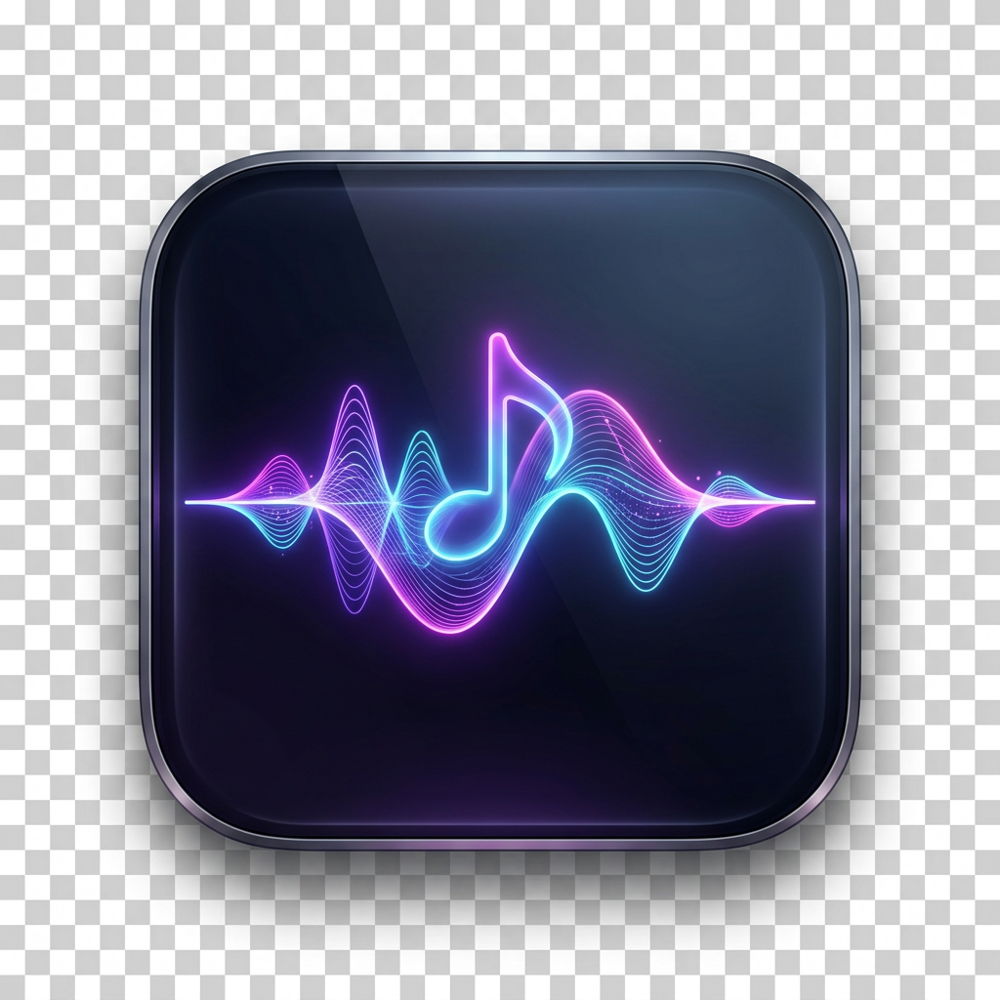

# LyriaFlow

<p align="center">
  
</p>

<p align="center">
  <strong>A minimalist, native macOS music player powered by Google Lyria AI and Gemini.</strong>
</p>

<p align="center">
  <a href="#quick-start">Quick Start</a> •
  <a href="#features">Features</a> •
  <a href="#architecture">Architecture</a> •
  <a href="docs/user-guide.md">User Guide</a> •
  <a href="#make-targets">Make Targets</a> •
  <a href="#license">License</a>
</p>

---

LyriaFlow is a standalone macOS application built in Swift and SwiftUI. It bridges directly to Google's [`mcp-lyria-go`](https://github.com/GoogleCloudPlatform/vertex-ai-creative-studio/tree/main/experiments/mcp-genmedia) Model Context Protocol (MCP) server over local stdio JSON-RPC to generate music on-the-fly with Google Cloud AI Lyria models (`lyria-3-clip-preview` and `lyria-3-pro-preview`).

While you listen to a track, an integrated Gemini engine suggests coherent next tracks, enables one-click 3-movement suite generation, and pre-generates audio in the background for zero-latency playback transitions.

```
+-----------------------------------------------------------------------------------+
|  LyriaFlow                                                                        |
|  +---------------------+-------------------------------------------------------+  |
|  | [Up Next] [History] |                     Now Playing                       |  |
|  |                     |                                                       |  |
|  | 1. Sunset Groove    |      ||||||||||||||||||||||||||||||||||||||||         |  |
|  |    [Ready]          |              32-Bar Reactive Spectrum                 |  |
|  |                     |                                                       |  |
|  | 2. Deep Motion      |  "Warm lo-fi ambient electronic music with soft keys" |  |
|  |    [Generating...]  |  Lyria 3 Pro • 30.0s • C2PA Signed • (i) Info         |  |
|  |                     |                                                       |  |
|  | 3. Cosmic Glide     |  Gemini Next-Track Suggestions:                       |  |
|  |    [Queued]         |  [Similar]             [Fun Twist]        [Wildcard]  |  |
|  |                     |  [Play] [+1] [3x Vibe] [Play] [+1] [3x]   [Play]...   |  |
|  +---------------------+-------------------------------------------------------+  |
|  |  0:12 [===================================-----------------------] 0:30     |  |
|  |  [Next: Deep Motion]          [Loop] [ > ] [ >> ]          [Auto-Play] [===] |  |
+-----------------------------------------------------------------------------------+
```

---

## Features

- **Direct MCP Integration**: Communicates with the local `mcp-lyria-go` process over stdio JSON-RPC with zero middleware.
- **Audio-Reactive 32-Bar Spectrum**: Real-time frequency spectrum visualizer driven by `AVAudioPlayer` peak and average power metering with smooth spring physics and resting baselines.
- **Apple macOS HIG Design**: Built with native macOS `.ultraThinMaterial` translucency, San Francisco (SF Pro) typographic hierarchy, and responsive split-view ergonomics.
- **Intelligent Gemini Suggestions**: Generates three distinct next-track variations while the current track plays:
  - **Similar**: Cohesive vibe continuation.
  - **Fun Twist**: Playful stylistic variation.
  - **Wildcard**: Genre-bending sonic departure.
- **Cohesive 3-Movement Suites ("Queue 3x Vibe")**: Generates evolutionary 3-track musical arcs (Movement I: Atmospheric Build, Movement II: Deep Groove, Movement III: Climax/Outro) exploring a chosen theme.
- **Background Pre-Generation Worker**: Pre-generates queued audio files in the background so track transitions happen with zero latency.
- **Interactive Up Next Playlist Queue**: Sidebar queue tab with live status badges (`Ready`, `Generating...`, `Queued`), drag-and-drop / button reordering, and individual track removal.
- **Local Persistence & Provenance**: Saves audio files to `~/Music/LyriaFlow/Tracks/` as native MP3 containers, preserving Google's C2PA ID3 cryptographic provenance signatures.
- **Track Metadata Inspector**: Get Info popover displaying prompt text, Lyria model ID, duration, creation timestamp, generation seed, format, and C2PA status.
- **Persistent Diagnostics**: Full application and MCP process logging to `~/Library/Logs/LyriaFlow/lyriaflow.log`.

---

## Architecture

LyriaFlow is organized into a modular Swift package architecture:

```
LyriaFlow/
├── Sources/
│   ├── LyriaFlow/               # App entry point & NSApplication delegate
│   │   └── App/LyriaFlowApp.swift
│   │
│   ├── LyriaFlowKit/            # Core framework library
│   │   ├── Models/              # Track, AppSettings, MCPModels
│   │   ├── Services/            # MCPClient, AudioEngine, GeminiSuggestionEngine,
│   │   │                        # PersistenceStore, AudioFormatDetector, AppLogger
│   │   ├── ViewModels/          # PlaybackCoordinator (@MainActor)
│   │   └── Views/               # MainSplitView, NowPlayingView, UpNextQueueView,
│   │                            # HistorySidebarView, SuggestionCardsView,
│   │                            # WaveformVisualizerView, TrackInspectorView,
│   │                            # TransportBar, PromptInputBar, SettingsView
│   │
│   └── LyriaFlowSpike/          # Headless CLI verification spike
│       └── main.swift
│
├── Tests/LyriaFlowTests/        # 31 unit tests covering all services & models
├── Resources/                   # AppIcon.icns, AppIcon.png, assets
├── Makefile                     # Build, test, run, app packaging, and install targets
└── scripts/build_app.sh         # macOS application bundle generator
```

---

## Quick Start

### Prerequisites

1. **macOS 14.0 (Sonoma) or later**
2. **Swift 5.9+ / Xcode Command Line Tools**
3. **`mcp-lyria-go` Binary**: Installed at `~/go/bin/mcp-lyria-go` or configured via app Settings.
   - Built from [GoogleCloudPlatform/vertex-ai-creative-studio](https://github.com/GoogleCloudPlatform/vertex-ai-creative-studio/tree/main/experiments/mcp-genmedia).
4. **Google Cloud Credentials & API Key**:
   ```bash
   export GOOGLE_APPLICATION_CREDENTIALS="/path/to/key.json"
   export GOOGLE_CLOUD_PROJECT="your-gcp-project-id"
   export GEMINI_API_KEY="your-gemini-api-key"
   ```

### Build & Run

```bash
# Clone the repository
git clone https://github.com/ghchinoy/LyriaFlow.git
cd LyriaFlow

# Run all unit tests
make test

# Launch the app in development mode
make run
```

---

## Make Targets

The project includes a streamlined `Makefile` for development:

| Target | Description |
|---|---|
| `make build` | Builds debug binaries for `LyriaFlow` and `LyriaFlowKit`. |
| `make run` | Assembles and launches `LyriaFlow.app` immediately. |
| `make test` | Executes the full 31-test unit test suite. |
| `make app` | Assembles a production release `.app` bundle. |
| `make install` | Copies the release `LyriaFlow.app` into `~/Applications`. |
| `make spike` | Runs the headless CLI spike test verifying stdio JSON-RPC against `mcp-lyria-go`. |
| `make clean` | Removes `.build/`, `.cache/`, and generated `.app` bundles. |

---

## Configuration & Credentials

LyriaFlow automatically discovers your Google Cloud and Gemini credentials through a 4-tier hierarchy:

1. **In-App Settings** *(Highest Priority)*: Enter your Gemini API key or custom `mcp-lyria-go` path in the Settings window (persisted to macOS `UserDefaults`).
2. **Shell Configuration**: Automatically parses `export GEMINI_API_KEY=...` and `export GOOGLE_APPLICATION_CREDENTIALS=...` from `~/.zshrc` or `~/.zshenv` (even when launched from Finder/Spotlight).
3. **Dotenv Files**: Loads variables from `~/.config/lyriaflow/.env`, `~/Music/LyriaFlow/.env`, or `./.env`.
4. **Google Cloud ADC**: Auto-detects `~/.config/gcloud/application_default_credentials.json` if set up via `gcloud auth application-default login`.

### Settings Options

- **Gemini API Key**: Google AI Studio API key for real-time prompt variations.
- **Gemini Model**: Select between `gemini-3.7-flash` and `gemini-3.5-flash-lite`.
- **Lyria MCP Binary Path**: Path to `mcp-lyria-go` with interactive "Test / Ping" button.
- **Default Music Model**: Choose between `lyria-3-clip-preview` (fast clips) and `lyria-3-pro-preview` (high-fidelity music).
- **Diagnostics & Logs**: Reveal or copy persistent application logs from `~/Library/Logs/LyriaFlow/lyriaflow.log`.

---

## Verification & Testing

The test suite runs with zero network dependencies by mocking audio player states and validating core models:

```bash
make test
```

Unit test coverage spans:
- `AudioFormatDetector` magic-byte inspection (ID3, MPEG frame sync, RIFF WAVE, FLAC, M4A).
- `PlaybackCoordinator` queue operations, reordering, and movement suite scheduling.
- `AudioEngine` 32-bar power metering, volume bounds, and resting baseline states.
- `PersistenceStore` metadata encoding roundtrips and multi-format directory scanning.
- `AppLogger` persistent write verification and log slicing.

---

## Documentation

For a detailed walkthrough of audio generation, queue mechanics, movement suites, and troubleshooting, read the **[User Guide](docs/user-guide.md)**.

---

## License & Disclaimer

LyriaFlow is open-source software licensed under the **Apache-2.0 License**. See [LICENSE](LICENSE) for details.

### Disclaimer
This project is an open-source community contribution and is not an officially supported Google product. This project is not eligible for the Google Open Source Software Vulnerability Rewards Program.

---

## Acknowledgements

- **Google Cloud Platform**: [Google Cloud AI Creative Studio `mcp-genmedia`](https://github.com/GoogleCloudPlatform/vertex-ai-creative-studio) for the `mcp-lyria-go` server and Lyria AI music models.
- **Model Context Protocol (MCP)**: For the standardized stdio JSON-RPC agent interface.
